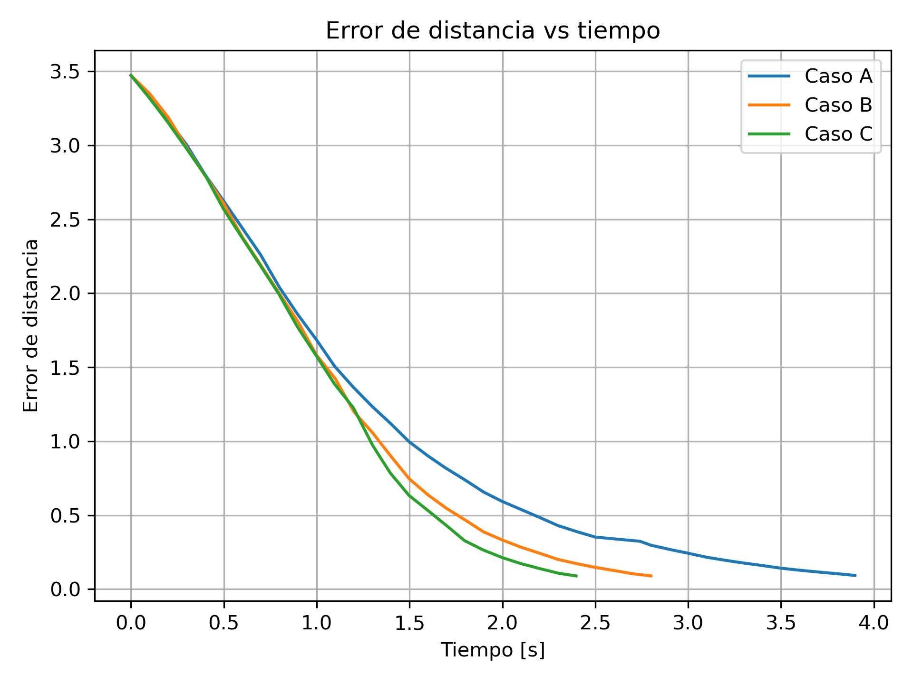
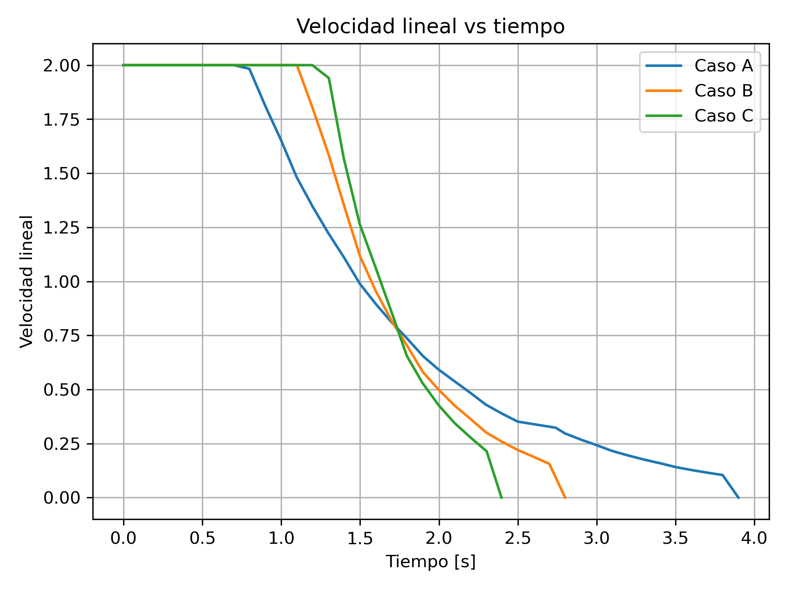
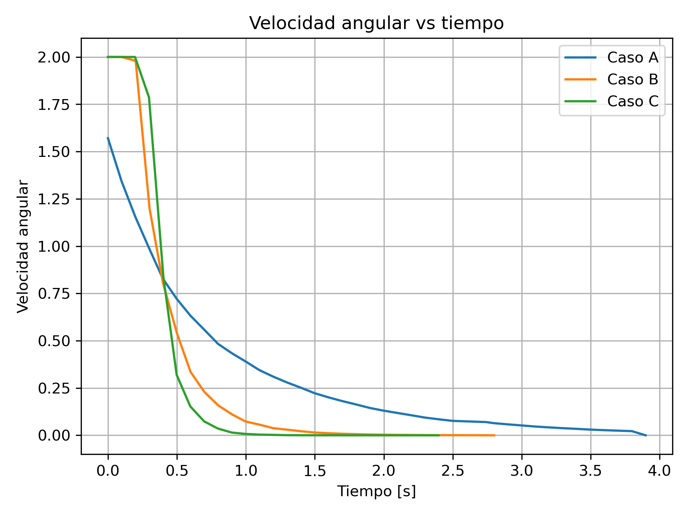

# Análisis de desempeño del controlador Go to Goal en ROS 2

## 1. Objetivo

El objetivo de esta práctica fue evaluar el desempeño de un controlador tipo **Go to Goal** implementado en ROS 2 usando `turtlesim`. A diferencia de una prueba básica donde únicamente se verifica si la tortuga llega a la meta, en este laboratorio se analizó qué tan eficiente, estable y preciso fue el comportamiento del controlador.

La meta utilizada fue:

```text
x_goal = 8.0
y_goal = 8.0
```

El controlador utilizado fue proporcional:

```text
v = k_linear * error_distancia
w = k_angular * error_angular
```

donde `v` representa la velocidad lineal y `w` representa la velocidad angular.

---

## 2. Métricas evaluadas

Las métricas registradas durante cada experimento fueron:

| Métrica | Descripción |
| Error inicial | Distancia inicial entre la tortuga y la meta |
| Error final | Distancia al momento de detenerse |
| Tiempo de llegada | Tiempo total necesario para alcanzar la tolerancia |
| Distancia recorrida | Longitud aproximada de la trayectoria seguida |
| Error máximo | Mayor error registrado durante la ejecución |
| Error promedio | Promedio del error de distancia |
| Oscilaciones | Cambios bruscos en el sentido de giro |
| Velocidad máxima | Mayor velocidad aplicada durante el movimiento |

---

## 3. Configuraciones evaluadas

Se probaron tres configuraciones diferentes de ganancias proporcionales.

| Caso | k_linear | k_angular | Tiempo | Error final | Distancia recorrida | Oscilaciones | Observaciones |
|---|---:|---:|---:|---:|---:|---:|---|
| A | 1.0 | 2.0 | 4.2091 s | 0.0965 | 3.5667 | 0 | Movimiento estable y suave, pero fue el más lento. |
| B | 1.5 | 4.0 | 2.9007 s | 0.0939 | 3.4731 | 0 | Más rápido que el caso A, sin oscilaciones y con trayectoria más eficiente. |
| C | 2.0 | 6.0 | 2.3972 s | 0.0885 | 3.4732 | 0 | Fue el más rápido y tuvo el menor error final, aunque usa ganancias más agresivas. |

---

## 4. Resultados experimentales

# Caso A

**Ganancias utilizadas:**

```text
k_linear = 1.0
k_angular = 2.0
```

**Métricas obtenidas:**

```text
Error inicial: 3
Error final: 0.0965
Tiempo de llegada: 4.2091 s
Distancia recorrida: 3.5667
Error máximo: 3.4727
Error promedio: 1.0824
Oscilaciones detectadas: 0
Velocidad máxima: 2.00
```

**Observación:**

El caso A presenta un comportamiento más conservador debido a que sus ganancias son menores. Esto puede producir una trayectoria más suave y con menos oscilaciones, pero también puede aumentar el tiempo de llegada a la meta.

---

# Caso B

**Ganancias utilizadas:**

```text
k_linear = 1.5
k_angular = 4.0
```

**Métricas obtenidas:**

```text
Error inicial: 3
Error final: 0.0939
Tiempo de llegada: 2.9007 s
Distancia recorrida: 3.4731
Error máximo: 3.4727
Error promedio: 1.3146
Oscilaciones detectadas: 0
Velocidad máxima: 2.00
```

**Observación:**

El caso B representa una configuración balanceada. La velocidad lineal permite acercarse rápidamente a la meta, mientras que la ganancia angular corrige la orientación sin generar demasiada inestabilidad.

---

# Caso C

**Ganancias utilizadas:**

```text
k_linear = 2.0
k_angular = 6.0
```

**Métricas obtenidas:**

```text
Error inicial: 3.4727
Error final: 0.0885
Tiempo de llegada: 2.3972 s
Distancia recorrida: 3.4732
Error máximo: 3.4727
Error promedio: 1.4366
Oscilaciones detectadas: 0
Velocidad máxima: 2.00
```

**Observación:**

El caso C puede disminuir el tiempo de llegada debido al aumento de ganancias. Sin embargo, al aplicar comandos más agresivos, también puede aumentar el número de oscilaciones y producir movimientos menos suaves.

---

## 5. Gráficas experimentales

En esta sección se deben agregar las capturas obtenidas durante los experimentos.

### Error de distancia vs tiempo

Agregar aquí la gráfica:

```markdown

```

**Interpretación:**

La gráfica de error de distancia contra tiempo permite observar la rapidez con la que el controlador converge hacia la meta. Un controlador eficiente debe reducir el error de forma progresiva hasta llegar a la tolerancia definida. Si el error disminuye lentamente, el sistema es estable pero poco rápido. Si el error presenta subidas y bajadas, esto puede indicar oscilaciones o movimientos innecesarios.

---

### Velocidad lineal vs tiempo

Agregar aquí la gráfica:

```markdown

```

**Interpretación:**

La velocidad lineal muestra qué tan rápido avanza la tortuga durante la trayectoria. Al inicio, la velocidad suele ser mayor porque el error de distancia es más grande. Conforme la tortuga se acerca a la meta, la velocidad disminuye, lo cual ayuda a detenerse de manera más precisa y suave.

---

### Velocidad angular vs tiempo

Agregar aquí la gráfica:

```markdown

```

**Interpretación:**

La velocidad angular permite analizar la corrección de orientación del robot. Cambios bruscos o cambios frecuentes de signo indican posibles oscilaciones. Una señal angular más suave generalmente representa un movimiento más estable.

---

### Comparación de métricas entre casos

Agregar aquí la gráfica o tabla comparativa:

```markdown

```

**Interpretación:**

La comparación entre casos permite identificar qué combinación de ganancias tuvo mejor desempeño. No necesariamente el controlador más rápido es el mejor, ya que puede producir más oscilaciones, mayor distancia recorrida o movimientos más agresivos.

---

## 6. Análisis de ingeniería

### Identify

**¿Cuáles son los objetivos principales del controlador?**

Los objetivos principales del controlador son llevar la tortuga desde su posición inicial hasta una meta fija, reducir el error de distancia, corregir la orientación hacia la meta y detenerse automáticamente cuando el error sea menor que la tolerancia establecida. Además, el controlador debe mantener un movimiento estable, suave y eficiente.

**¿Qué restricciones de diseño identificaste?**

Las principales restricciones fueron la precisión de llegada, la estabilidad del movimiento, las limitaciones de velocidad lineal y angular, la reducción de oscilaciones, la distancia recorrida y el tiempo necesario para alcanzar la meta. También se consideró que el movimiento no debía ser demasiado agresivo para evitar trayectorias innecesarias.

---

### Analyze

**¿Cómo afectan las ganancias del controlador al desempeño?**

La ganancia lineal `k_linear` afecta directamente la rapidez con la que la tortuga avanza hacia la meta. Si esta ganancia es muy baja, el movimiento es lento; si es muy alta, puede generar desplazamientos agresivos. La ganancia angular `k_angular` afecta la rapidez con la que la tortuga corrige su orientación. Una ganancia angular baja puede causar trayectorias amplias, mientras que una ganancia demasiado alta puede producir oscilaciones.

**¿Qué métricas fueron más importantes para evaluar el sistema?**

Las métricas más importantes fueron el tiempo de llegada, el error final, la distancia recorrida y el número de oscilaciones. Estas métricas permiten evaluar si el controlador fue rápido, preciso, eficiente y estable.

---

### Develop Solutions

**¿Qué estrategia utilizaste para mejorar el controlador?**

La estrategia utilizada fue limitar las velocidades máximas y reducir la velocidad lineal cuando el error angular era grande. Esto permitió que la tortuga corrigiera primero su orientación antes de avanzar demasiado rápido, reduciendo movimientos innecesarios y mejorando la estabilidad.

**¿Qué combinación de ganancias produjo el mejor resultado?**

La mejor combinación de ganancias fue la del Caso C, con k_linear = 2.0 y k_angular = 6.0. Esta configuración obtuvo el menor tiempo de llegada, el menor error final y no presentó oscilaciones. Aunque sus ganancias son más agresivas, el controlador mantuvo un comportamiento estable y eficiente durante la trayectoria.


### Evaluate Solutions

**¿Qué controlador tuvo mejor desempeño y por qué?**

El principal trade-off observado fue que al aumentar las ganancias el sistema responde más rápido, pero existe el riesgo de generar movimientos bruscos u oscilaciones. Sin embargo, en esta prueba el Caso C mantuvo cero oscilaciones, por lo que fue la mejor opción entre las tres configuraciones evaluadas.

**¿Qué trade-offs observaste entre rapidez y estabilidad?**

Se observó que aumentar las ganancias puede reducir el tiempo de llegada, pero también puede incrementar las oscilaciones y generar movimientos más bruscos. Por otro lado, disminuir las ganancias mejora la suavidad del movimiento, pero puede aumentar el tiempo necesario para llegar a la meta. Por lo tanto, el mejor controlador no es necesariamente el más rápido, sino el que mantiene un equilibrio entre rapidez, precisión y estabilidad.

---

## 7. Sustainability

**¿Por qué minimizar oscilaciones y trayectorias innecesarias puede ser importante en robots reales?**

Minimizar oscilaciones y trayectorias innecesarias es importante porque en un robot real cada movimiento implica consumo de energía, desgaste de motores, esfuerzo mecánico y posibles riesgos de seguridad. Un robot que se mueve de forma estable y eficiente utiliza menos recursos y puede operar durante más tiempo.

**¿Cómo impacta la eficiencia de movimiento en el consumo energético, desgaste mecánico, seguridad y sostenibilidad?**

Un movimiento eficiente reduce el consumo energético porque el robot recorre menos distancia y evita aceleraciones innecesarias. También disminuye el desgaste mecánico en motores, ruedas y estructura. Desde el punto de vista de seguridad, una trayectoria suave reduce el riesgo de colisiones o movimientos inesperados. Finalmente, un sistema eficiente contribuye a la sostenibilidad porque aprovecha mejor la energía disponible y reduce el mantenimiento del sistema.

---

## 8. Conclusión

El controlador Go to Goal permitió llevar la tortuga hacia una meta fija utilizando una ley de control proporcional. Sin embargo, al evaluar métricas de desempeño se observó que no basta con llegar a la meta; también es necesario analizar la rapidez, precisión, distancia recorrida y estabilidad del sistema. La comparación entre diferentes ganancias permitió identificar el efecto de los parámetros del controlador y seleccionar una configuración más adecuada para obtener un movimiento eficiente y estable.
